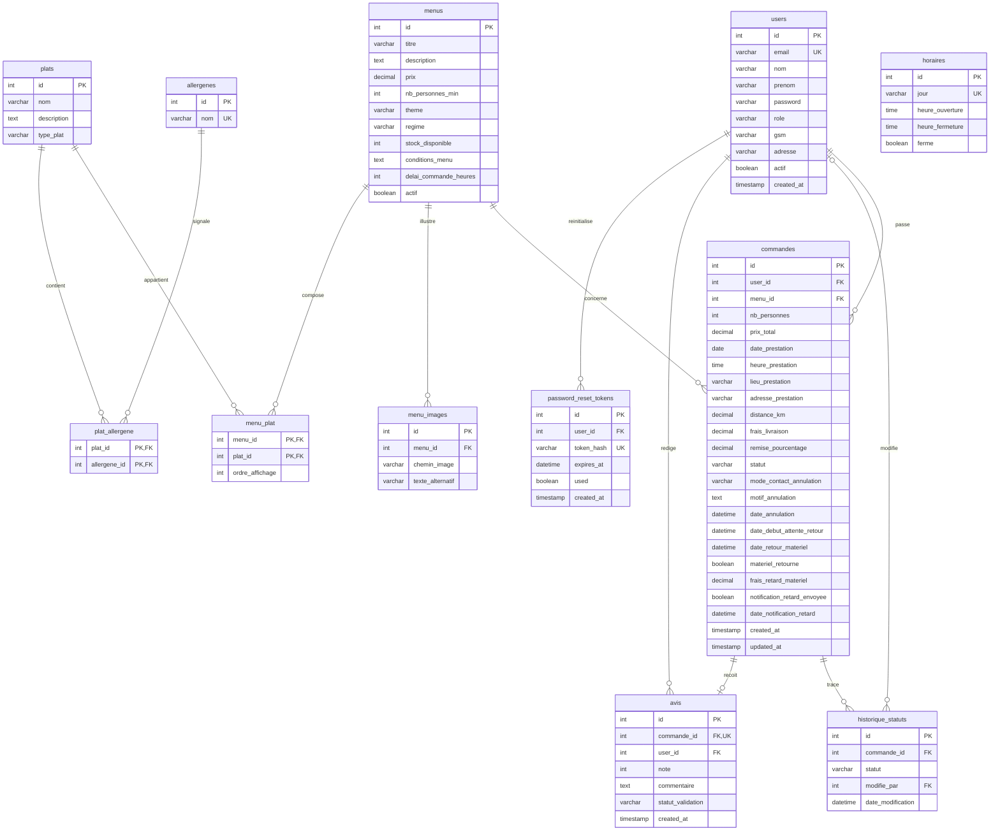
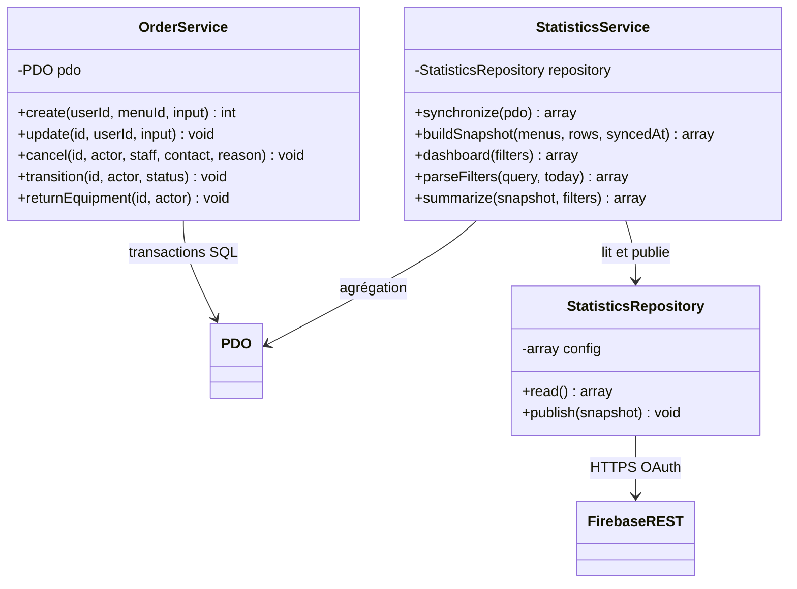
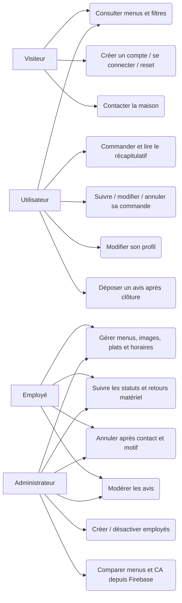
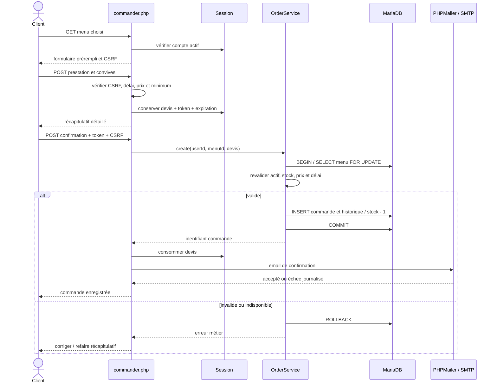
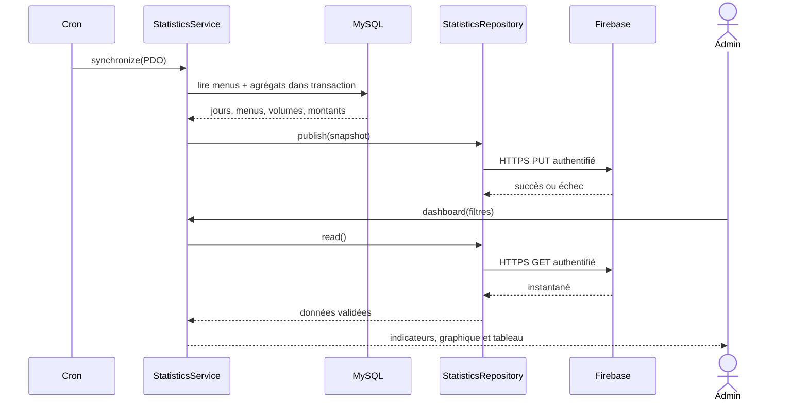

# Modèle des données et diagrammes

Le [MCD conceptuel](mcd.md) dispose d'un [export PDF](../output/pdf/mcd-vite-gourmand.pdf) et de trois vues SVG éditables : entités, associations et cardinalités, sans clés étrangères ni types SQL. Le présent fichier rassemble le schéma relationnel et les diagrammes UML en sources Mermaid éditables.

## Modèle relationnel / schéma SQL

Ce schéma représente les tables, clés et types réellement implémentés. Les associations plusieurs-à-plusieurs du MCD deviennent les tables `menu_plat` et `plat_allergene`. Les règles applicatives ajoutent notamment l'égalité entre propriétaire de l'avis et propriétaire de sa commande.

`horaires` est un référentiel indépendant. PK = clé primaire, FK = clé étrangère, UK = unicité. Sur avis, commande_id est unique indépendamment de id. L'auteur d'un historique est nullable et devient NULL si le compte est supprimé. Menus/users référencés par commandes ne sont pas supprimables en cascade. Les comptes se désactivent.

## Classes réelles

OrderRules, OrderNotifications, sécurité et templates sont des modules de fonctions, pas des classes artificiellement ajoutées au diagramme.

## Cas d'utilisation

## Séquence : passage d'une commande

## Séquence : statistiques

Si Firebase est indisponible, le dernier parcours produit une erreur explicite; aucune lecture SQL de secours n'alimente les statistiques.
